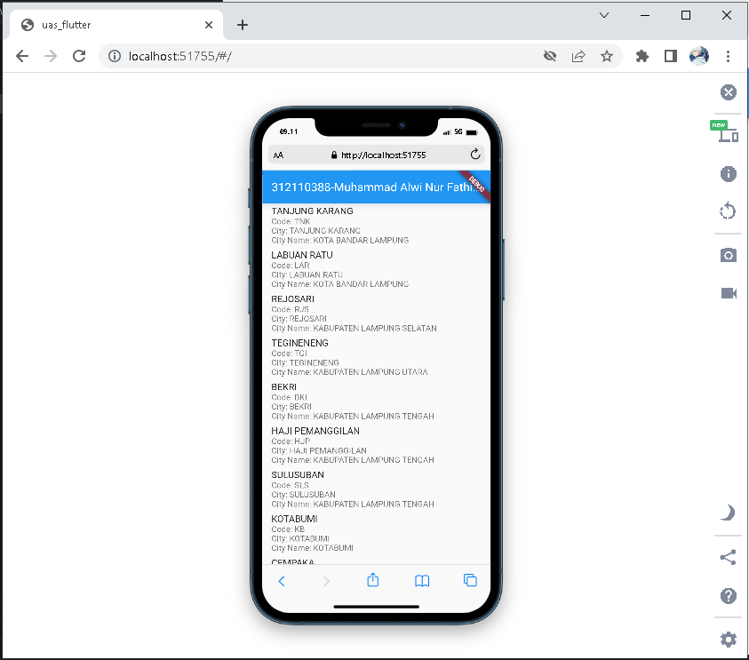

# UAS Pemrograman Mobile 2
## Profil
| #               | Biodata                         |
| --------------- | ------------------------------- |
| **Nama**        | Muhammad Alwi Nur Fathihah      |
| **NIM**         | 312110388                       |
| **Kelas**       | TI.21.A.1                       |
| **Mata Kuliah** | Pemrograman Mobile 2            |

## Uas Mobile2 : Memunculkan Api ListView dengan Flutter

 **`Link Api`**
https://booking.kai.id/api/stations2

# Hasil

**SELESAI**

